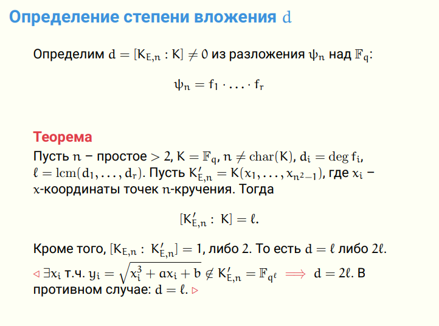
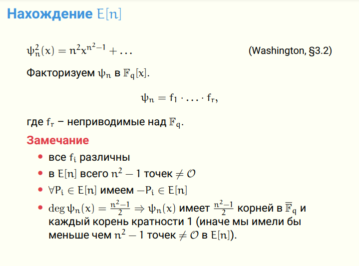

# Лаба 3

## Вопросы:

1. Связь между многочленом деления и степенью расширения
    
    Для нахождения степени необходимо факторизовать многочлен деления и найти НОК степеней многочленов из его факторизации. НОК ищется из-за теоремы об изоморфизме конечных полей.
    

2. Приложение билинейных отображений (кроме лекции)

    [https://www.google.com/search?q=Examples+of+Pairing-Based+Constructions&oq=Examples+of+Pairing-Based+Constructions](https://www.google.com/search?q=Examples+of+Pairing-Based+Constructions&oq=Examples+of+Pairing-Based+Constructions&gs_lcrp=EgZjaHJvbWUyBggAEEUYOdIBBzM0MmowajeoAgCwAgA&sourceid=chrome&ie=UTF-8)

    [https://theory.stanford.edu/~dfreeman/talks/ants.pdf](https://theory.stanford.edu/~dfreeman/talks/ants.pdf)

    A One Round Protocol for Tripartite Diffie–Hellman [https://link.springer.com/content/pdf/10.1007/s00145-004-0312-y.pdf](https://link.springer.com/content/pdf/10.1007/s00145-004-0312-y.pdf)

    ABE Attribute Base Encryption (Объяснить смысл ABE)

    KZG Kate-Zaverucha-Goldberg
